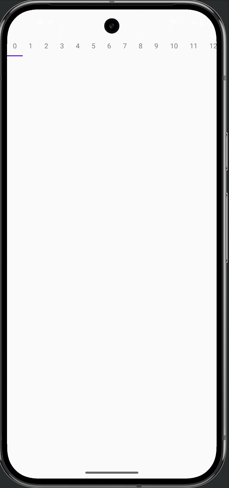

# irurueta-android-recycler-tab-layout
Implementation of a tab layout using a recycler view

[](https://github.com/albertoirurueta/irurueta-android-recycler-tab-layout/actions)

[](https://sonarcloud.io/dashboard?id=albertoirurueta_irurueta-android-recycler-tab-layout)
[](https://sonarcloud.io/dashboard?id=albertoirurueta_irurueta-android-recycler-tab-layout)

[](https://sonarcloud.io/dashboard?id=albertoirurueta_irurueta-android-recycler-tab-layout)
[](https://sonarcloud.io/dashboard?id=albertoirurueta_irurueta-android-recycler-tab-layout)

[](https://sonarcloud.io/dashboard?id=albertoirurueta_irurueta-android-recycler-tab-layout)
[](https://sonarcloud.io/dashboard?id=albertoirurueta_irurueta-android-recycler-tab-layout)
[](https://sonarcloud.io/dashboard?id=albertoirurueta_irurueta-android-recycler-tab-layout)

[](https://sonarcloud.io/dashboard?id=albertoirurueta_irurueta-android-recycler-tab-layout)
[](https://sonarcloud.io/dashboard?id=albertoirurueta_irurueta-android-recycler-tab-layout)
[](https://sonarcloud.io/dashboard?id=albertoirurueta_irurueta-android-recycler-tab-layout)

[](https://search.maven.org/artifact/com.irurueta/irurueta-android-recycler-tab-layout/1.0.0/aar)

[API Documentation](http://albertoirurueta.github.io/irurueta-android-recycler-tab-layout)

## Overview

This library contains an implementation of a view similar in appearance to Android's TabLayout.
https://developer.android.com/reference/com/google/android/material/tabs/TabLayout

However, TabLayout implementation is not appropriate in situations where there are many items to be
displayed and each of those items contain complex or memory intensive views such as when attempting
to display image thumbnails in each tab.

This view attempts to solve this issue by using a RecyclerView to display such items and adding a
line indicator similar to the one used in TabLayout in order to obtain a similar behavior.



##Usage

Add the following dependency to your project:

```
implementation 'com.irurueta:irurueta-android-recycler-tab-layout:1.1.0'
```

The view can be added to your xml layout as the example below:

```
   <com.irurueta.android.recyclertablayout.RecyclerTabLayout
        android:id="@+id/recycler_tab_layout"
        android:layout_width="match_parent"
        android:layout_height="wrap_content" />
```

Since the RecyclerTabLayout extends from RecyclerView,
in order to display items, an adapter, a view holder and item views, must be set:

First we define a view to use on each item of the adapter:
```
class TabView @JvmOverloads constructor(
    context: Context,
    attrs: AttributeSet? = null,
    defStyleAttr: Int = 0
) : RelativeLayout(context, attrs, defStyleAttr) {

    private var tabNameView: TextView? = null

    var tabName: String?
        get() = tabNameView?.text?.toString()
        set(value) {
            tabNameView?.text = value
        }

    init {
        // Load layout
        LayoutInflater.from(context).inflate(R.layout.tab_view, this)

        tabNameView = findViewById(R.id.tab_name)
    }
}
```

Then a view holder for each item:
```
class TabViewHolder(val view: TabView) : RecyclerView.ViewHolder(view)
```

Then an adapter:
```
class TabAdapter(val count: Int) : RecyclerView.Adapter<TabViewHolder>() {

    override fun onCreateViewHolder(parent: ViewGroup, viewType: Int): TabViewHolder {
        val v = TabView(parent.context)
        return TabViewHolder(v)
    }

    override fun onBindViewHolder(holder: TabViewHolder, position: Int) {
        holder.view.tabName = position.toString()
    }

    override fun getItemCount(): Int {
        return count
    }
}
```

And finally, we set the adapter to the recycler tab layout:
```
class RecyclerTabLayoutActivity : Activity() {

    private var recyclerTabLayout: RecyclerTabLayout? = null

    override fun onCreate(savedInstanceState: Bundle?) {
        super.onCreate(savedInstanceState)
        setContentView(R.layout.recycler_tab_layout_view_activity)
        recyclerTabLayout = findById(R.id.recycler_tab_layout))
        recyclerTabLayout.adapter = TabAdapter(COUNT)
    }
    
    private companion object {
        const val COUNT = 20
    }    
}

```

By setting a click listener for each item view, the selected item on the RecyclerTabLayout can be
changed by calling:
```
recyclerTabLayout.setCurrentItem(position)
```